# UML AcordeHub

Este documento resume la arquitectura UML de AcordeHub para la version web y mobile, basado en la estructura actual del proyecto.

## 1. Vista general del sistema

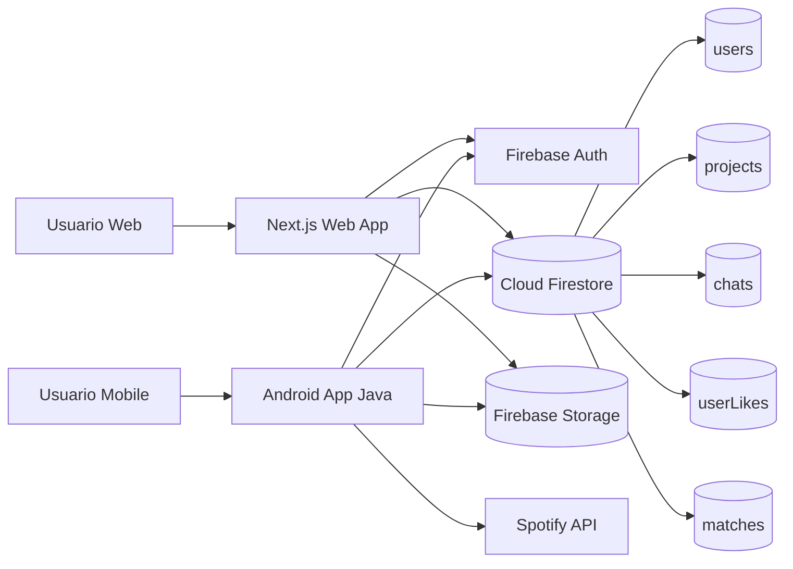

## 2. UML de componentes - Web

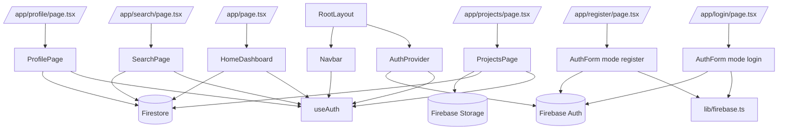

## 3. UML de clases - Web

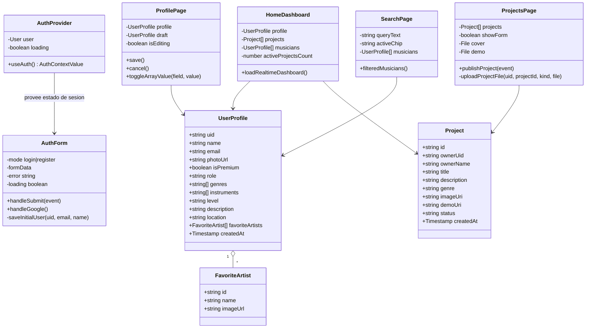

## 4. Flujo web - registro/login

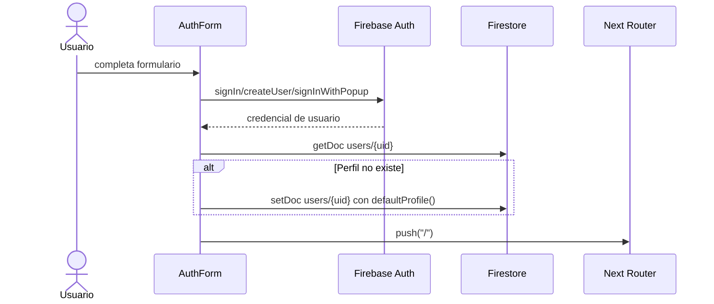

## 5. Flujo web - publicar proyecto

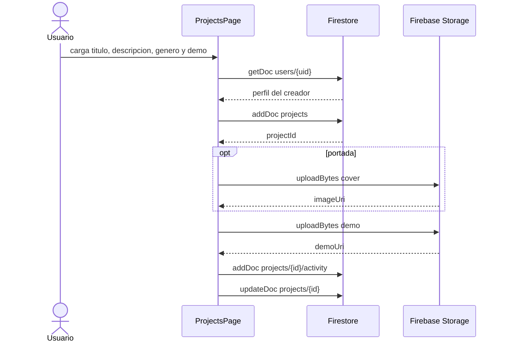

## 6. UML de componentes - Mobile

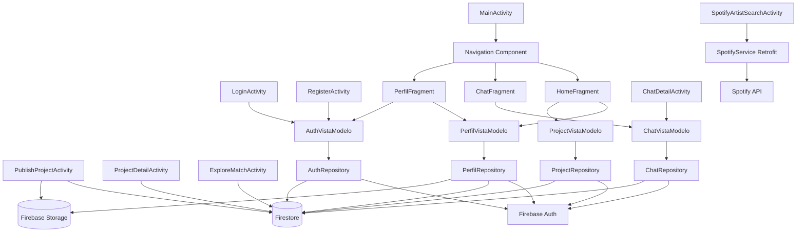

## 7. UML de clases - Mobile

```mermaid
classDiagram
    class AuthVistaModelo {
        -AuthRepository repository
        -LiveData userLiveData
        -LiveData errorLiveData
        -LiveData loadingLiveData
        +register(name, email, password)
        +login(email, password)
        +loginWithGoogle(account)
        +logout()
        +getCurrentUser()
    }

    class AuthRepository {
        -FirebaseAuth firebaseAuth
        -FirebaseFirestore db
        +registerWithEmail(name, email, password, callback)
        +loginWithEmail(email, password, callback)
        +loginWithGoogle(account, callback)
        +logout()
        +getCurrentUser()
        -saveUserToFirestore(uid, name, email, callback)
    }

    class PerfilVistaModelo {
        -PerfilRepository repository
        -LiveData perfilLiveData
        -LiveData errorLiveData
        -LiveData loadingLiveData
        +cargarPerfil()
        +guardarPerfil(name, role, genres, instruments, level, description, location, photoUrl, favoriteArtists)
        +subirFoto(imageUri)
    }

    class PerfilRepository {
        -FirebaseFirestore db
        -FirebaseStorage storage
        -FirebaseAuth auth
        +getPerfil(callback)
        +guardarPerfil(user, callback)
        +subirFoto(imageUri, callback)
        -createDefaultUser()
    }

    class ProjectVistaModelo {
        -ProjectRepository repository
        -LiveData projectsLiveData
        -LiveData joinRequestsLiveData
        -LiveData activeProjectsCountLiveData
        +escucharProyectosDestacados()
        +escucharMisProyectosActivos()
        +escucharSolicitudesRecibidas()
        +responderSolicitud(request, status, callback)
    }

    class ProjectRepository {
        -FirebaseAuth auth
        -FirebaseFirestore db
        +listenToFeaturedProjects(callback)
        +listenToMyActiveProjectsCount(callback)
        +listenToReceivedJoinRequests(callback)
        +respondToJoinRequest(request, status, callback)
    }

    class ChatVistaModelo {
        -ChatRepository repository
        -LiveData conversationsLiveData
        -LiveData messagesLiveData
        -LiveData openedChatLiveData
        +escucharConversaciones()
        +escucharMensajes(chatId)
        +iniciarChatConEmail(email)
        +enviarMensaje(chatId, text)
        +getCurrentUid()
    }

    class ChatRepository {
        -FirebaseAuth auth
        -FirebaseFirestore db
        +listenToConversations(callback)
        +listenToMessages(chatId, callback)
        +startChatWithEmail(email, callback)
        +startChatWithUid(otherUid, callback)
        +sendMessage(chatId, text, callback)
        -createOrOpenChat(currentUid, firebaseUser, otherUser, callback)
        -buildChatId(firstUid, secondUid)
    }

    class SpotifyService {
        +getToken(basicAuth, grantType)
        +searchArtists(token, query, type, market)
    }

    AuthVistaModelo --> AuthRepository
    PerfilVistaModelo --> PerfilRepository
    ProjectVistaModelo --> ProjectRepository
    ChatVistaModelo --> ChatRepository
    SpotifyArtistSearchActivity --> SpotifyService
```

## 8. UML de modelos - Mobile y Firebase

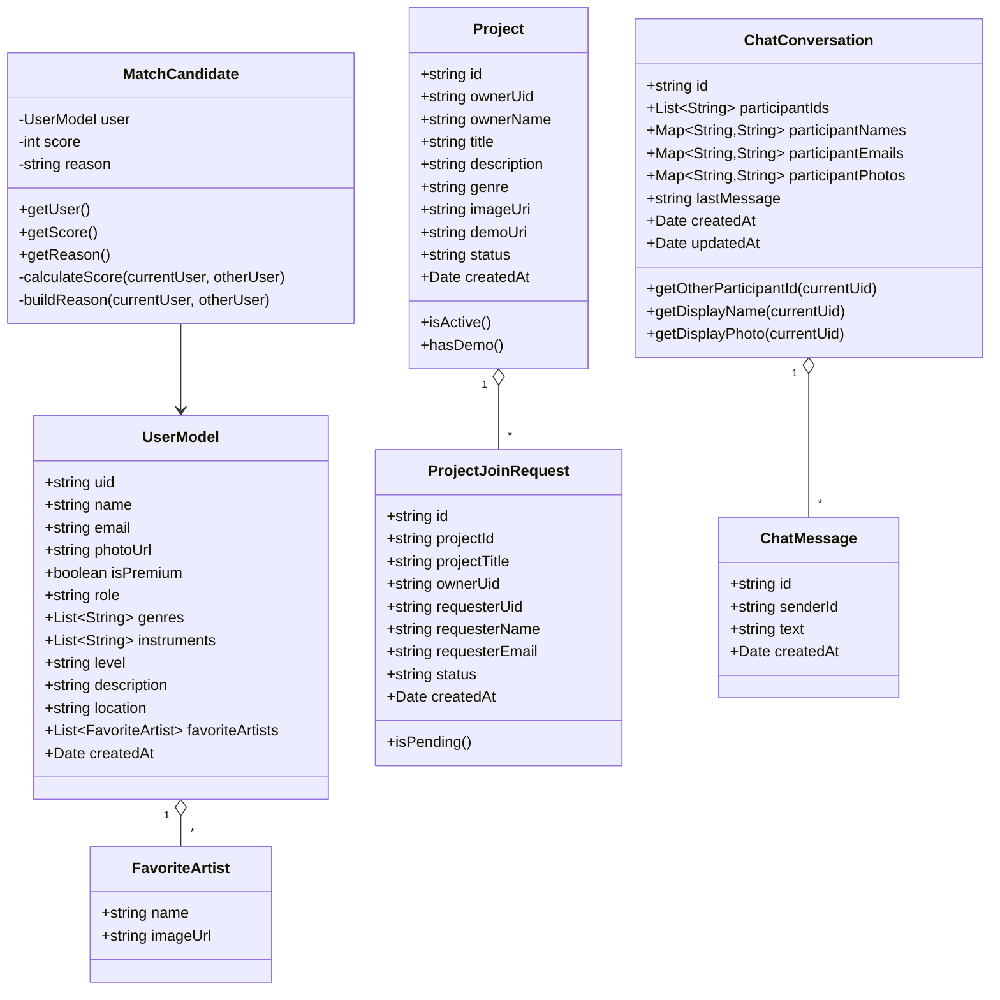

## 9. Navegacion mobile

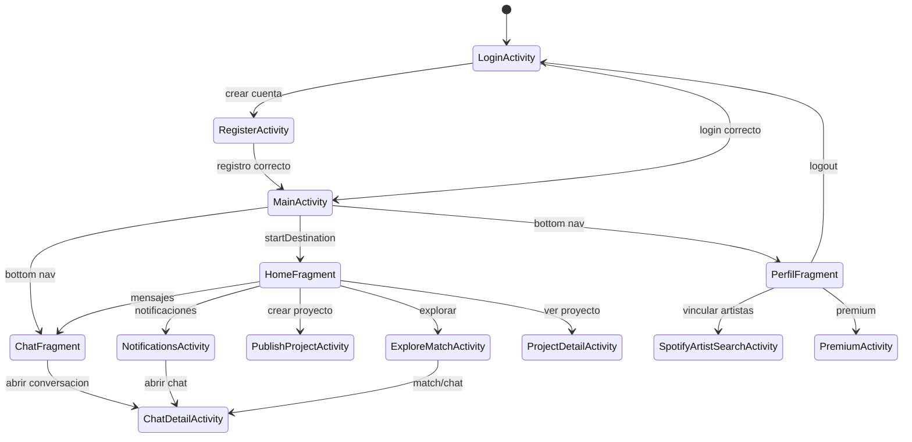

## 10. Flujo mobile - chat

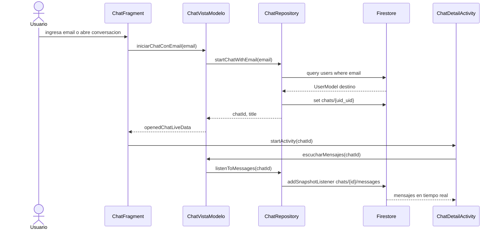

## 11. Flujo mobile - match

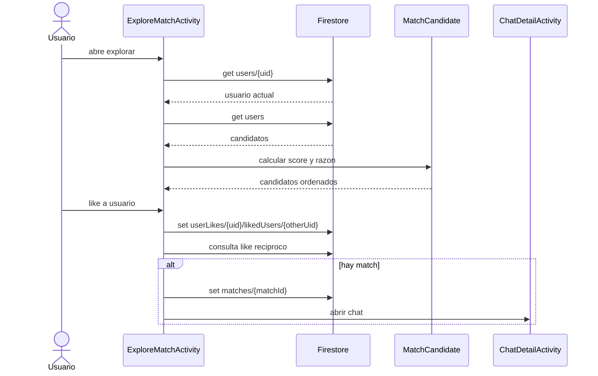

## 12. Colecciones Firebase usadas

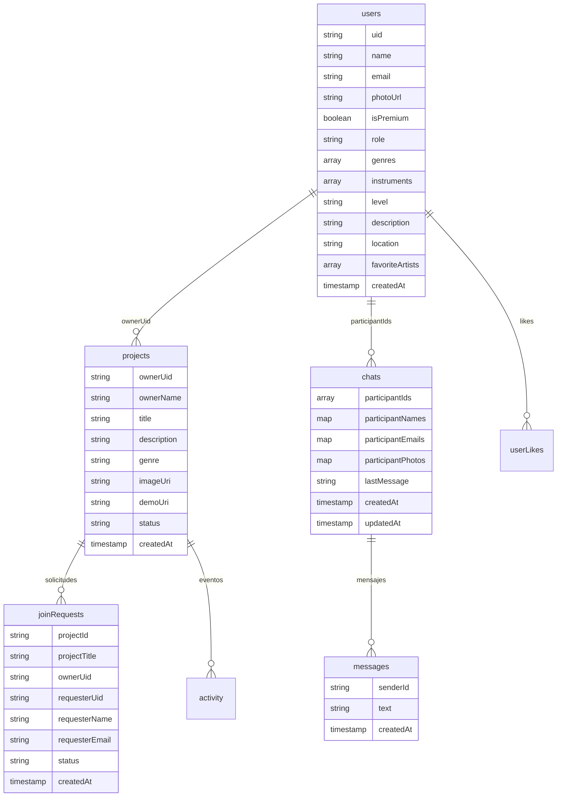
